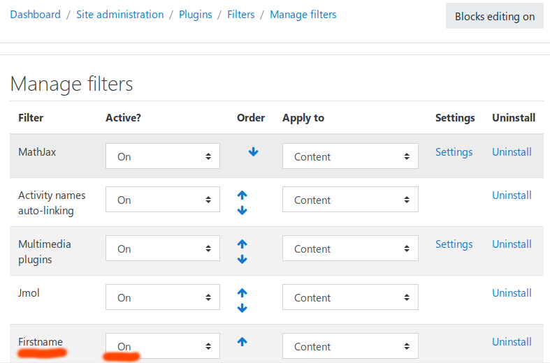
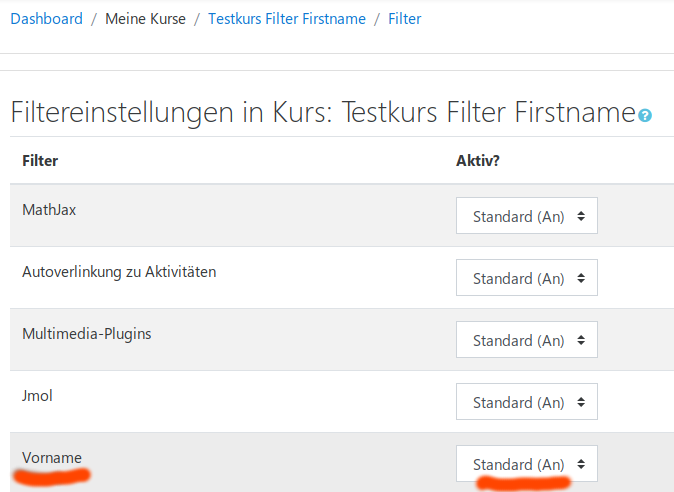
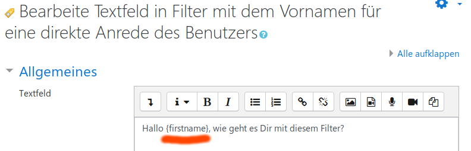
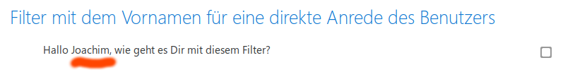

# Firstname
## filter_firstname

Moodle Filter Plugin which replaces the wildcard {firstname} with the actual firstname of the current Moodle user in any Moodle activity or textblock.

  * [Joachim Jakob, 2017](https://quizdidaktik.de/moodle_plugins/)

